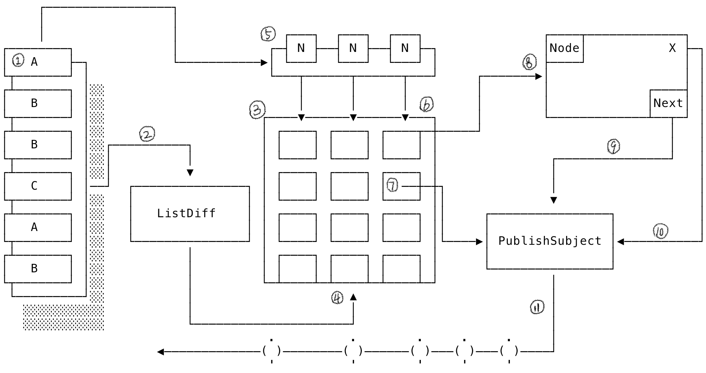

# Ark

**Ark** provides an option to adopt high performance of both **Texture** and **IGListKit**, without any boilerplate code stand in the way.

## Internal Workflow


1. an instance of `A` which implements **SectionInflator** protocol.
2. applying a new snapshot triggers diff processing.
3. instance of `ASCollectionNode` from _Texture_.
4. call `performBatchUpdates` on *collectionNode* with diff results.
5. instance of **SectionInflator** provides an array of **AnyNodable** elements.
6. instance of **AnyNodable** will map to an instance of `ASCellNode` in *collectionNode*.
7. *collectionNode*'s delegate methods create a new event passed into **rx.nodeEventChannel**.
8. showing an example what a custom cell node looks like.
9. custom node maps user action to an event in **rx.nodeEventChannel**.
10. differentiate user actions by enum `NodeEvent.Action`.
11. subscribe to **rx.nodeEventChannel** on instance of **DiffableDataSource** for future events (more details later).

## Transition to Ark

### Prerequisite
1. [Texture](https://github.com/texturegroup/texture), especially  [_LayoutSpecs_](https://texturegroup.org/docs/layout2-layoutspec-types.html).
2. [RxSwift](https://github.com/ReactiveX/RxSwift)

### Setup
1. Set `ASCollectionNode` as ViewController's _root_ node.

	```swift
	import AsyncDisplayKit
	
	class ViewController: ASDKViewController<ASCollectionNode> {
		required init?(coder: NSCoder) { // storyboard
			// create layout instance
			let node = ASCollectionNode(collectionViewLayout: layout)
			super.init(node)
		}
	}
	```
	
2. Create an instance of `DiffableDataSource`.
	
	```swift
	import Ark
	
	class ViewController: ASDKViewController<ASCollectionNode> {
		private lazy var dataSource = DiffableDataSource<HomeFeed>(collectionNode: node)
		
		// ...
	}
	```
	
3. Implements `SectionInflator` for your _HomeFeed_ type.

	```swift
	import Ark
	
	enum HomeFeed: SectionInflator {
		case banner(Banner)[^]
		case subjects(SubjectFeed)
		
		var diffIdentifier: AnyHashbale {
			switch self {
			case .banner(let banner):
				return banner.diffIdentifier
			case .subjects(let feed):
				return feed.date
			}
		}
		
		var items: [AnyNodable] {
			switch self {
			case .banner(let banner):
				return [AnyNodable(banner)]
			case .subjects(let feed):
				return feed.subjects.map(AnyNodable.init)
			}
		}
	}
	```
	
4. Implements `Nodable` for your _Banner_ type.

	```swift
	struct Banner: Nodable {
		let imageName: String
		
		var diffIdentifier: AnyHashable {
			imageName
		}
		
		func nodeBlock(with channel: NodeEventChannel, indexPath: IndexPath) -> ASCellNodeBlock {
			let image = UIImage(named: imageName)! // main thread operation
			return { Node(image: image) }
		}
		
		final class Node: ASCellNode {
			var imageNode: ASImageNode
			
			init(image: UIImage) {
				self.imageNode = ASImageNode()
				
				super.init()
				
				automaticallyManagesSubnodes = true
				backgroundColor = .systemBackground
				
				imageNode.image = image
				imageNode.cornerRadius = 4
				imageNode.contentMode = .scaleAspectFit
			}
			
			override func layoutSpecThatFits(_ constrainedSize: ASSizeRange) -> ASLayoutSpec {
				ASWrapperLayoutSpec(layoutElement: imageNode)
			}
		}
	}
	```

5. Subscribe on `rx.nodeEventChannel` of `dataSource` to handle collection node's delegate methods callback and other target actions, for example, to move the selected subject to the bottom of the section:

	```swift
	dataSource
		.rx.nodeEventChannel()
		.subscribe(onNext: { [unowned self] (event: GenericNodeEvent<SubjectFeed.Subject>) in
			let targetSection = event.indexPath.section
			guard case .subjects(let feed) = self.sections[targetSection],
				let index = feed.subjects.firstIndex(of: event.model) else {
				return
			}
			if case .selected = event.action {
				var subjects = feed.subjects
				subjects.remove(at: index)
				subjects.append(event.model)
				let newFeed: HomeFeed = .subjects(.init(date: feed.date, subjects: subjects))
				self.sections[targetSection] = newFeed
			}
		})
		.disposed(by: disposeBag)
	```
Note that in `onNext` closure you should specify the `Nodable` type, and it will be called when events related to or from that type's node arrives.

6. Call `apply(_:animatingDifferences:completion:)` on `dataSource`, Isn't this what you have been waiting for?

	```swift
	private var sections: [HomeFeed] = [] {
		didSet {
			updateUI(animated: true)
		}
	}
	
	private fun updateUI(animated: Bool = false) {
		dataSource.apply(.init(sections: sections), animatingDifferences: true, completion: nil)
	}
	```

## TODO:

- [ ] Support Installation via CocoaPods

## References
+ [ListDiff: Swift port of IGListKit's IGListDiff](https://github.com/lxcid/ListDiff)

## Index
+ [DiffableDataSource](https://github.com/imkdir/Ark/blob/master/Ark/DiffableDataSource.swift#L45)
+ [DiffableDataSourceSnapshot](https://github.com/imkdir/Ark/blob/6c83355663b9c0c9eadbd2b84512e3528d5ac981/Ark/DiffableDataSource.swift#L15)
+ [NodeEventChannel](https://github.com/imkdir/Ark/blob/6c83355663b9c0c9eadbd2b84512e3528d5ac981/Ark/DiffableDataSource.swift#L34)
+ [SectionInflator](https://github.com/imkdir/Ark/blob/6c83355663b9c0c9eadbd2b84512e3528d5ac981/Ark/Nodable.swift#L17)
+ [Nodable](https://github.com/imkdir/Ark/blob/6c83355663b9c0c9eadbd2b84512e3528d5ac981/Ark/Nodable.swift#L24)
+ [AnyNodable](https://github.com/imkdir/Ark/blob/master/Ark/AnyNodable.swift#L84)
+ [GenericNodeEvent](https://github.com/imkdir/Ark/blob/6c83355663b9c0c9eadbd2b84512e3528d5ac981/Ark/NodeEvent.swift#L33)
